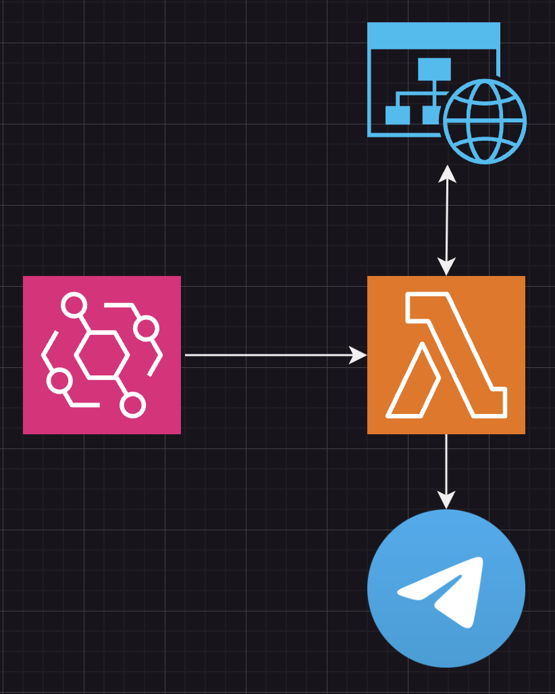

# speed-trap-check
This is an old project that I developed when living in Italy. 
It consists of doing some web scraping on the italian police website (https://www.poliziadistato.it/articolo/autovelox-e-tutor-dove-sono), which posts publicly every week the approximate location of active speed traps on italian highways.
Here is how it works.

An EventBridge rule triggers a Lambda function every friday and sunday (the two days that I used the highway).
The Lambda function does some web scraping on the police website, by reading the PDFs of every region that interests me, filtering for cities that are on my route.
After doing this, it creates a message and sends it to me through a Telegram bot.

This way, I just need to check Telegram on my phone and I will know which speed traps are active and which are not, without having to manually check it on the police website.

